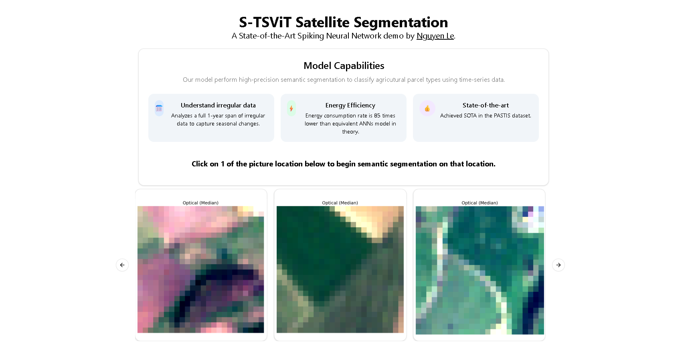
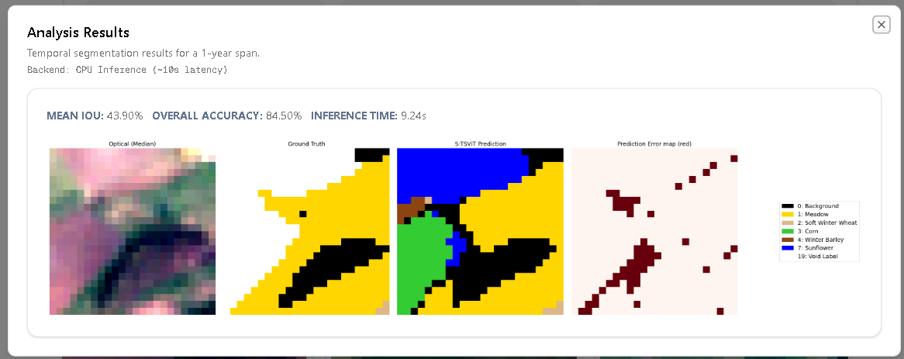

# Satellite Image Analysis Platform

[](https://nextjs.org)
[](https://www.typescriptlang.org)
[](https://tailwindcss.com)
[](https://ui.shadcn.com)

A web application for analyzing satellite imagery using our proposed SNNs models.
## Demo
Live: https://s-ts-vi-t-segmentation-deployment-f.vercel.app/  

> ⚠️ **Deployment Note**: Frontend demo requires private Hugging Face backend. So if you want to deploy the frontend yourself you need to set up the HF space your own. 
> See [Setup](#setup) to run with your own HF Space.

## Overview

This is the frontend to interact with our proposed model **S-TSViT** that performs 
semantic segmentation on Satellite Image Time-series (SITS) data.

## Tech Stack

| Layer | Technology |
|-------|-----------|
| Framework | [Next.js 15](https://nextjs.org) (App Router) |
| Language | TypeScript |
| Styling | Tailwind CSS |
| UI Components | shadcn/ui |
| ML Backend | Hugging Face Inference API (private) |

## Features

### 🎯 Core Capability
Crop type classification at pixel level — semantic segmentation for agricultural monitoring.

### 🤖 One-Click ML Analysis
- **Server-Side Inference**: Secure calls to Hugging Face API via 
  Next.js Server Actions (`actions/analyze_img.ts`)
- **Real-time Feedback**: Loading spinner during ~10s model inference
- **S-TSViT Model**: Custom transformer architecture for satellite time-series segmentation

### 📊 Interactive Result Modal
- **Quantitative Metrics**: mIoU (Mean Intersection over Union), 
  OA (Overall Accuracy), inference time
- **Visual Output**: Base64-encoded segmentation maps rendered inline

### 🔒 Secure API Integration
HF API token stored server-side — never exposed to client.

## Screenshots

| Carousel | Result |
|----------|--------|
|  |  |

## Setup

### Prerequisites

- Node.js 18+
- Hugging Face Space with your model deployed

### Installation

```bash
git clone <your-repo>
npm install
```

### Environment

Create `.env.local`:

HF_URL=https://your-space.hf.space
HF_API_TOKEN_SECRET=hf_xxxxxxxx


### Run

npm run dev


Open [http://localhost:3000](http://localhost:3000)

## Project Structure


actions/
  analyze_img.ts      # HF API integration
components/
  carousel_home.tsx   # Image carousel + analysis modal
  ui/                 # shadcn components


## License

MIT
